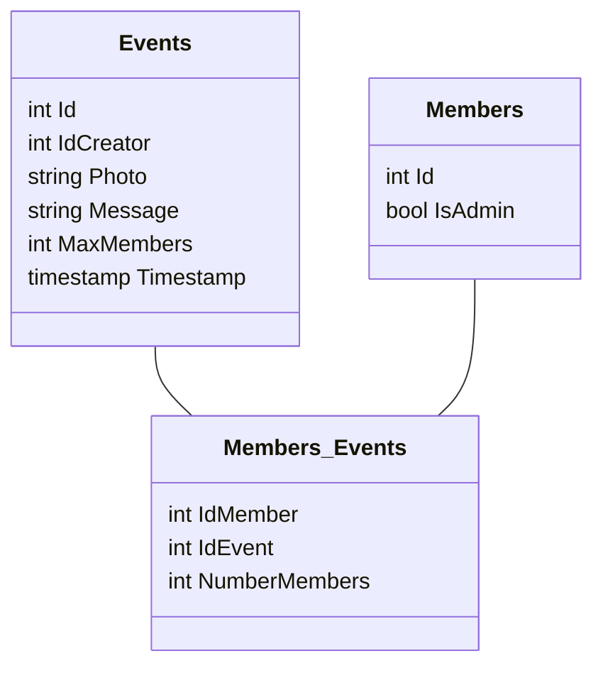
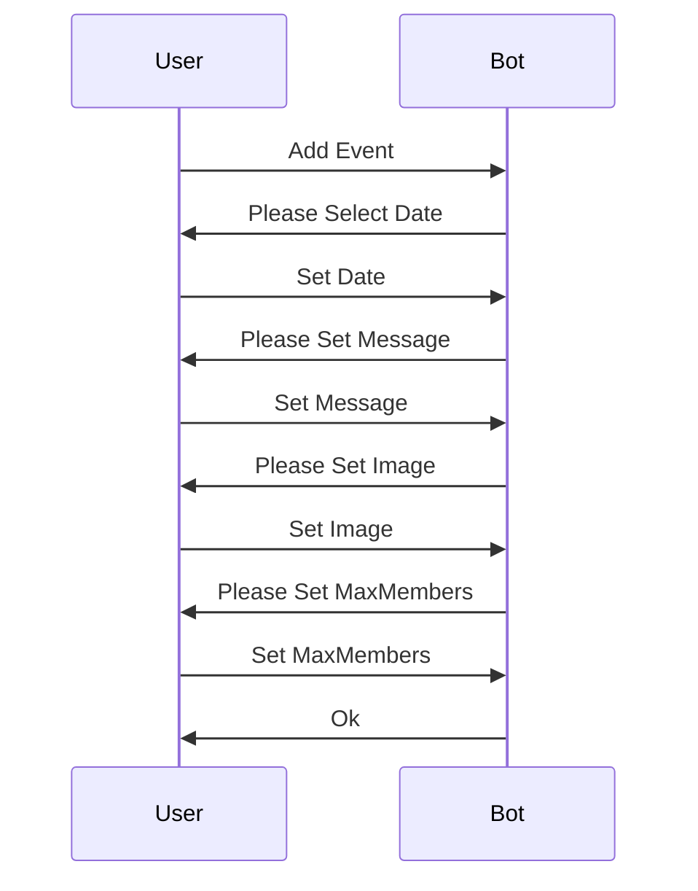
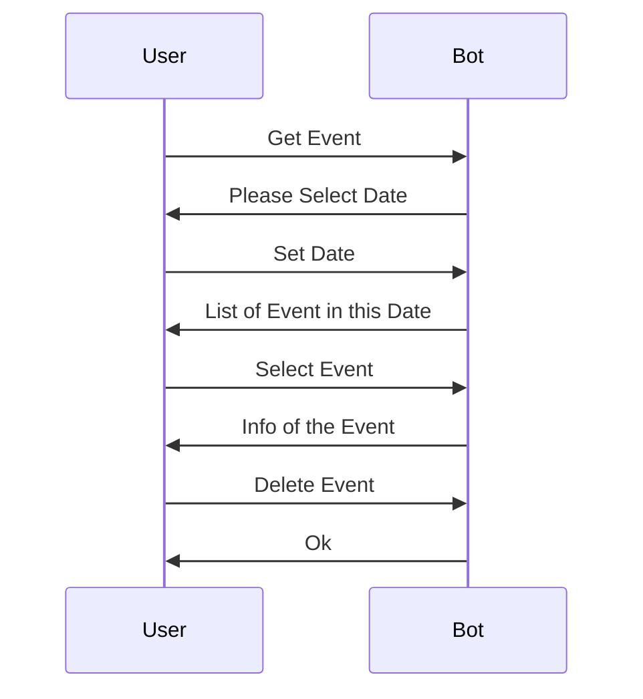
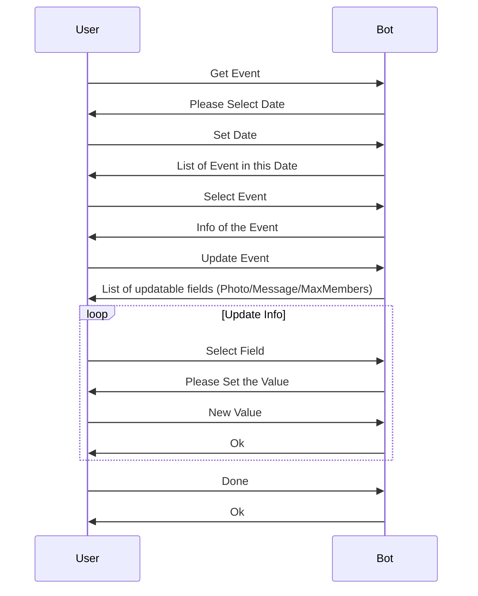
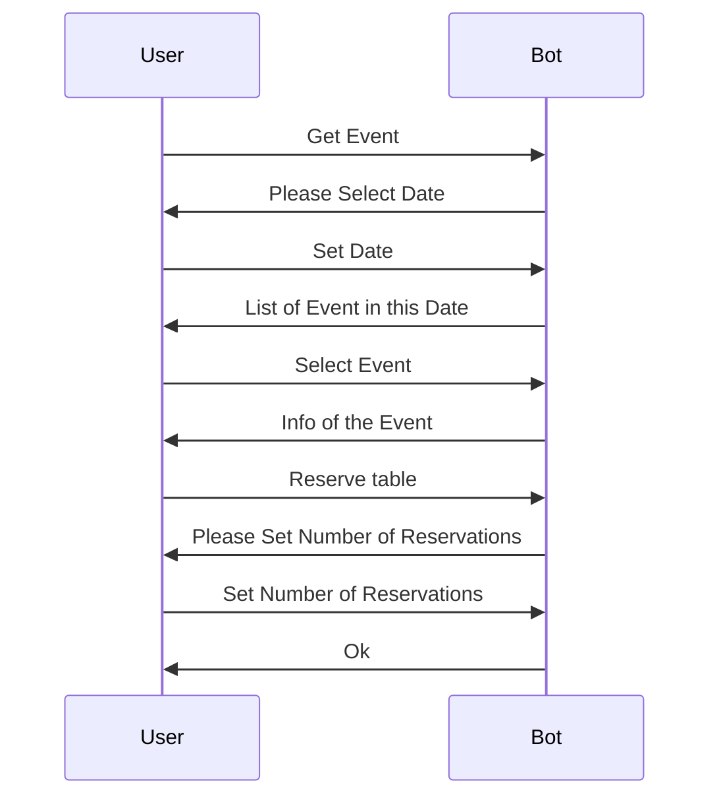
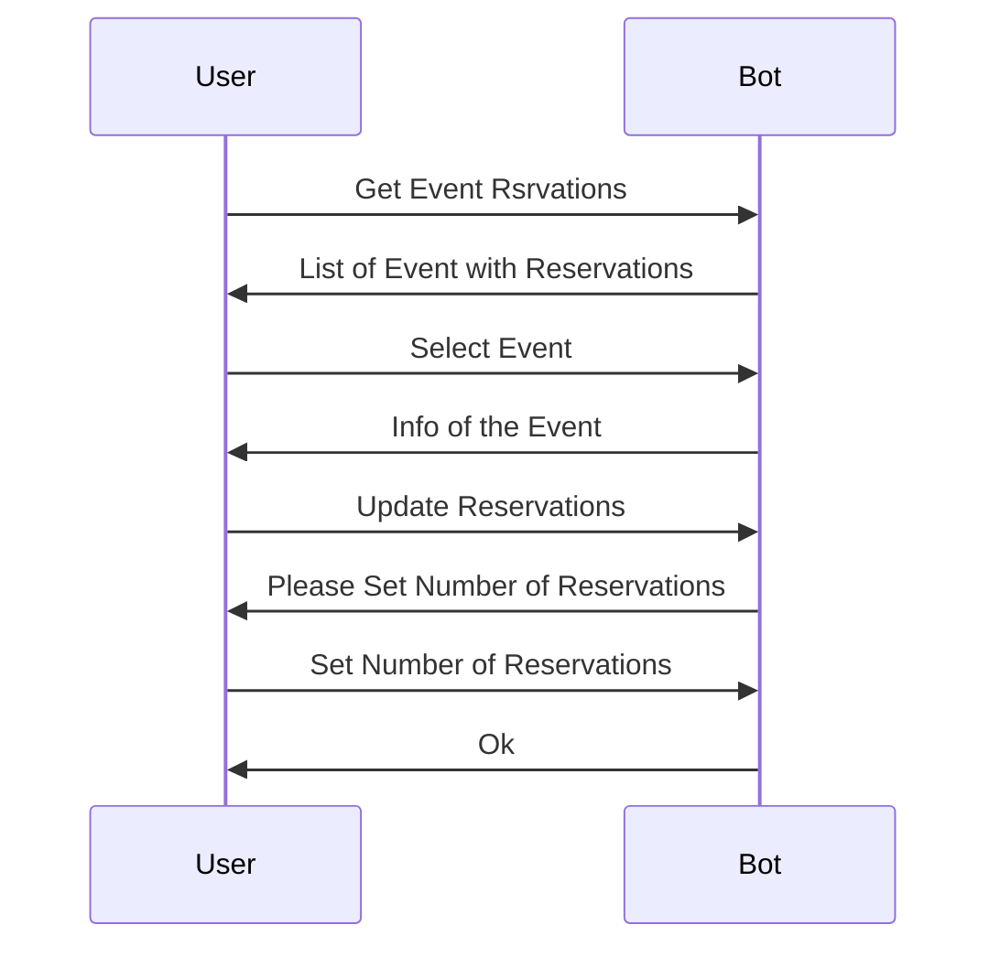
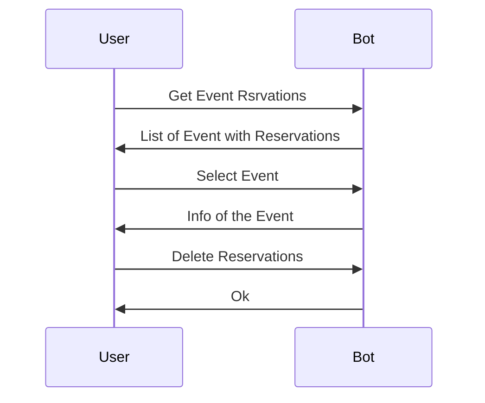

# Entity (PostgreSQL)

# Endpoints (Python)

## Admin

### Add Specific Event

### Delete Specific Event

### Update Specific Event

## User (Flowchart)

### Add Reservation at Event

### Update Reservation at Event

### Delete Reservation at Event

# Architecture

Databases:
* Postgres for persistence data
* Mongodb for user status

Bot (Python):
* Bot User
* Bot Admin
